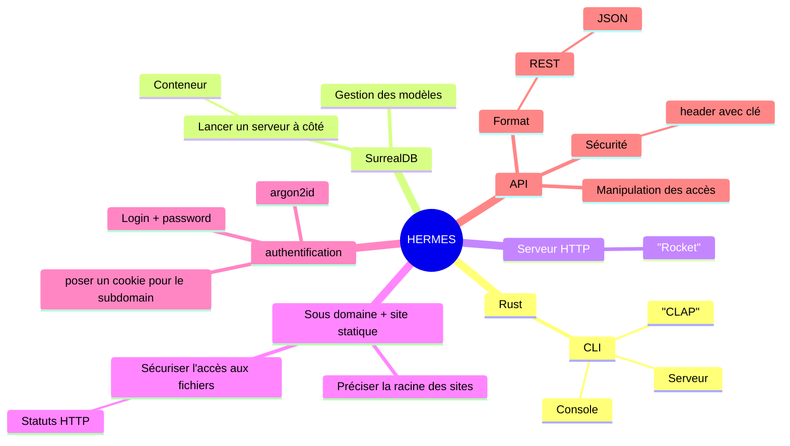

# Spécifications

Le projet doit être un serveur web capable de servir de multiples 
sites web statiques via sous-domaines différents.

Une authentification doit être activable pour faire en sorte que des
utilisateurs aient des permissions d'accès à certains sites et pas d'autress.

Les utilisateurs devront être ajoutable par API avec une sécurité simple, 
la sécurité étant assurée par le layer infra.

La sécurité HTTPS sera assurée par un reverse proxy.

## Mindmap

> Vous pouvez trouver la mindmap au format `.mmd` [ici](./specs.mmd).

> Vous pouvez trouver la mindmap au format `.svg` [ici](./mindmap.png).

