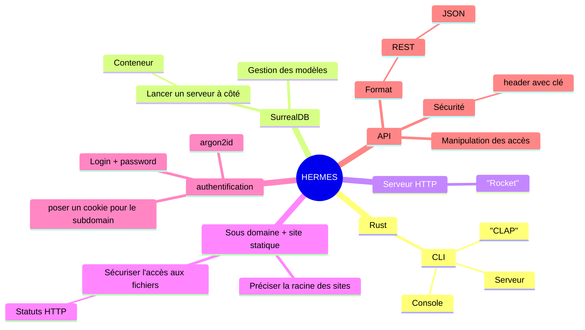

# Tasks

## Techniques

### Initialisation du projet
- rustup update
- initialiser le projet
- lancer la base de donnée
    - créer un docker compose pour surrealDB
- créer la CLI avec CLAP
    - créer un bootstrap
    - créer le lancement du serveur
    - créer le lancement de l'interface de commande (console)

### TBD

